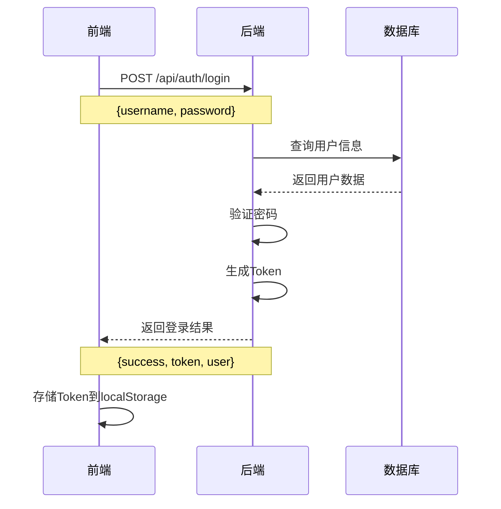
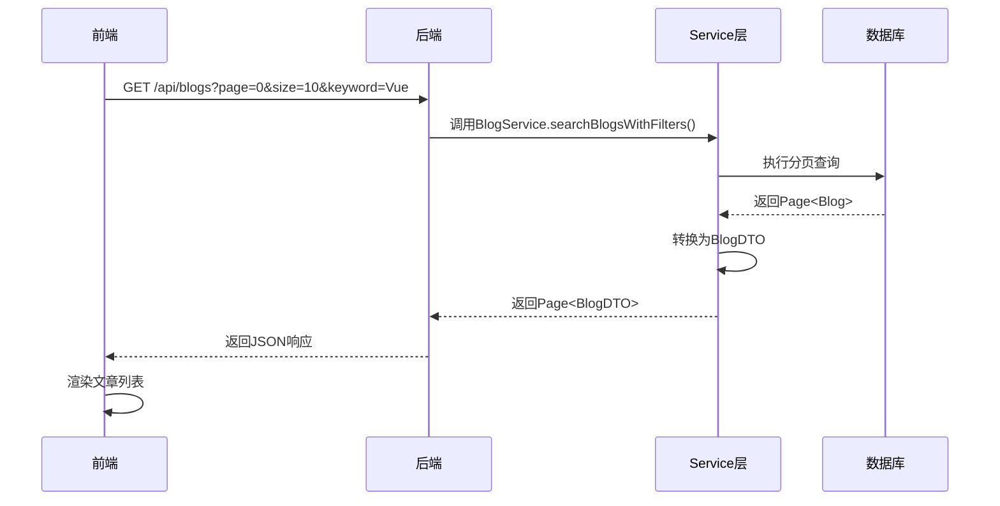
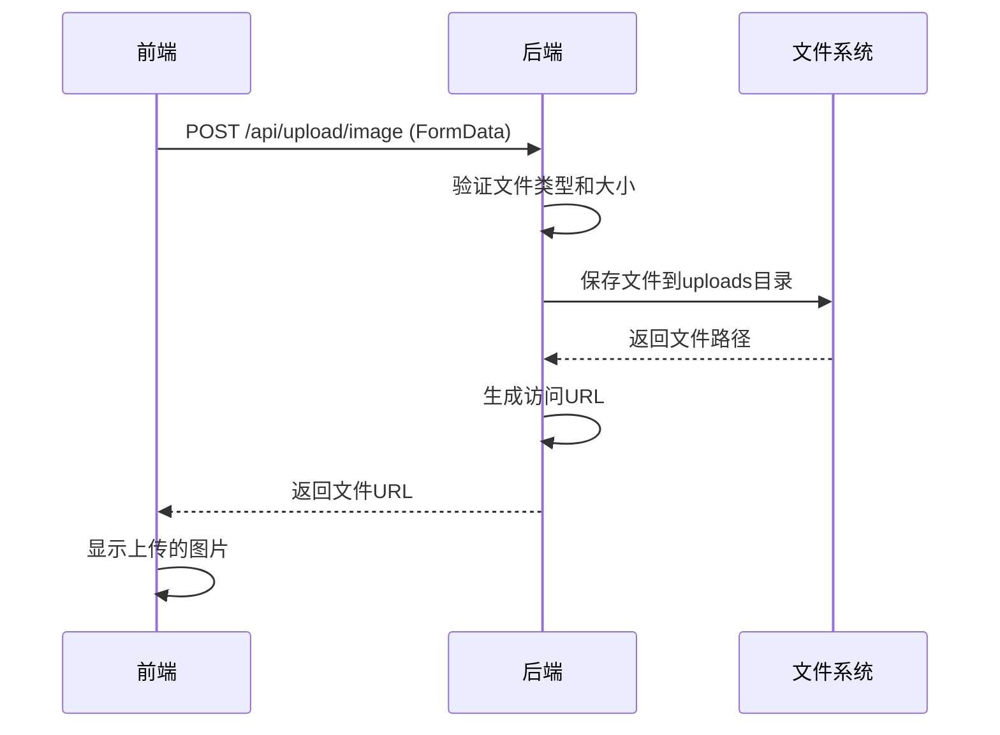

# 博客系统数据通信传输机制详细文档

## 目录
1. [系统架构概述](#系统架构概述)
2. [前后端通信机制](#前后端通信机制)
3. [核心功能数据传输流程](#核心功能数据传输流程)
4. [API接口详细说明](#api接口详细说明)
5. [数据传输安全机制](#数据传输安全机制)
6. [错误处理机制](#错误处理机制)
7. [性能优化策略](#性能优化策略)

## 系统架构概述

### 技术栈
- **前端**: Vue 3 + Vite + Element Plus + Axios
- **后端**: Spring Boot + Spring Data JPA + MySQL
- **通信协议**: HTTP/HTTPS + RESTful API
- **数据格式**: JSON

### 架构模式
```
┌─────────────────┐    HTTP/JSON    ┌─────────────────┐
│   Vue 3 前端    │ ◄──────────────► │  Spring Boot    │
│                 │                 │     后端        │
│ - 组件化UI      │                 │ - RESTful API   │
│ - Axios HTTP    │                 │ - 业务逻辑层    │
│ - 状态管理      │                 │ - 数据访问层    │
└─────────────────┘                 └─────────────────┘
                                              │
                                              ▼
                                    ┌─────────────────┐
                                    │   MySQL 数据库   │
                                    │                 │
                                    │ - 用户数据      │
                                    │ - 博客内容      │
                                    │ - 评论数据      │
                                    └─────────────────┘
```

## 前后端通信机制

### 1. 网络配置

#### 前端代理配置 (vite.config.js)
```javascript
export default defineConfig({
  server: {
    port: 3000,
    proxy: {
      '/api': {
        target: 'http://localhost:8080',  // 后端服务地址
        changeOrigin: true,               // 改变请求源
        secure: false                     // 允许非HTTPS
      }
    }
  }
})
```

#### 后端跨域配置
```java
@CrossOrigin(originPatterns = { 
    "http://localhost:*", 
    "http://127.0.0.1:*" 
}, allowCredentials = "true")
```

### 2. HTTP客户端配置

#### Axios使用方式
```javascript
// 基础请求
import axios from 'axios'

// GET请求示例
const response = await axios.get('/api/blogs', {
  params: {
    page: 0,
    size: 10,
    keyword: '搜索关键词'
  }
})

// POST请求示例
const response = await axios.post('/api/blogs', {
  title: '文章标题',
  content: '文章内容',
  category: '技术分享'
})

// 带认证的请求
const config = {
  headers: {
    'Authorization': `Bearer ${token}`
  }
}
const response = await axios.get('/api/auth/profile', config)
```

### 3. 统一响应格式

#### ApiResponse工具类
```java
public class ApiResponse<T> {
    private boolean success;    // 操作是否成功
    private String message;     // 响应消息
    private T data;            // 响应数据
    
    // 成功响应
    public static <T> ApiResponse<T> success(T data) {
        return new ApiResponse<>(true, "操作成功", data);
    }
    
    // 错误响应
    public static <T> ApiResponse<T> error(String message) {
        return new ApiResponse<>(false, message, null);
    }
}
```

#### 响应数据格式
```json
{
  "success": true,
  "message": "操作成功",
  "data": {
    // 具体业务数据
  }
}
```

## 核心功能数据传输流程

### 1. 用户认证流程

#### 用户登录

我们假设博客系统有一个登录功能，用户在前端输入用户名和密码，点击登录按钮后，前端会向后端发送一个POST请求，携带用户名和密码。后端验证通过后，会返回一个token（通常是JWT）给前端，前端存储这个token（例如在localStorage或cookie中），并在后续的请求中携带这个token以验证用户身份。

**登录功能实现的详细步骤：**

##### 1. 前端部分（Vue.js实现）

**步骤1：创建登录表单**
- 创建登录表单，包含用户名和密码输入框以及登录按钮
- 使用Vue的响应式数据绑定用户输入

**步骤2：处理登录事件**
- 当用户点击登录按钮时，触发一个登录方法（如handleLogin）
- 在handleLogin方法中，收集用户名和密码，然后使用axios（或其他HTTP库）向后端的登录API发送POST请求

**步骤3：处理登录响应**
- 接收后端返回的响应数据
- 如果登录成功，将返回的token存储在localStorage中
- 跳转到首页或其他需要登录的页面
- 如果登录失败，显示错误信息

##### 2. 后端部分（Spring Boot实现）

**步骤1：创建登录接口**
- 创建一个登录接口（如/api/auth/login），接收POST请求
- 使用@RequestBody注解接收请求体中的用户名和密码

**步骤2：验证用户身份**
- 从数据库中查询用户信息
- 验证用户名和密码是否匹配

**步骤3：生成认证Token**
- 如果验证成功，生成一个JWT token
- 将token和用户信息一起返回给前端
- 如果验证失败，返回错误信息

##### 3. 后续请求的认证

**前端部分**
- 在每次发送请求时，通过axios的请求拦截器，将token放在请求头中（通常是Authorization头）
- 处理401未授权响应，如跳转到登录页面

**后端部分**
- 创建一个拦截器（或过滤器）来验证token的有效性
- 从请求头中获取token并解析
- 验证token是否有效，是否过期
- 如果token有效，将用户信息存储在请求上下文中，供后续处理使用
- 如果token无效或过期，返回401未授权响应



**前端实现**:
```javascript
const loginUser = async () => {
  try {
    const endpoint = loginType.value === "admin" 
      ? "/api/admin/login" 
      : "/api/auth/login";
    
    const response = await axios.post(endpoint, {
      username: loginForm.username,
      password: loginForm.password,
    });

    if (response.data.success) {
      const token = response.data.data.token;
      const userInfo = response.data.data.user;
      
      // 存储认证信息
      localStorage.setItem("token", token);
      localStorage.setItem("userInfo", JSON.stringify(userInfo));
      
      router.push("/");
    }
  } catch (error) {
    ElMessage.error("登录失败");
  }
};
```

**后端实现**:
```java
@PostMapping("/login")
public ResponseEntity<Object> loginUser(@RequestBody Map<String, String> request) {
    String account = request.get("account");
    String password = request.get("password");
    
    Optional<User> userOpt = userService.authenticate(account, password);
    
    if (userOpt.isPresent()) {
        User user = userOpt.get();
        // 生成简单Token (实际项目建议使用JWT)
        String token = "token_" + user.getId() + "_" + System.currentTimeMillis();
        
        Map<String, Object> data = new HashMap<>();
        data.put("token", token);
        data.put("user", user);
        
        return ResponseEntity.ok(Map.of(
            "success", true,
            "message", "登录成功",
            "data", data
        ));
    }
    
    return ResponseEntity.badRequest().body(Map.of(
        "success", false,
        "message", "账号或密码错误"
    ));
}
```

### 2. 博客文章管理流程

#### 获取文章列表


**博客列表获取功能实现的详细步骤：**

##### 1. 前端部分（Vue.js实现）

**步骤1：定义响应式数据**
- 创建响应式数据存储文章列表、分页信息、筛选条件等
- 设置默认的分页大小和当前页码

**步骤2：创建获取文章列表的方法**
- 定义异步方法fetchBlogs来获取文章列表
- 构建查询参数对象，包含分页、关键词、分类、标签等筛选条件

**步骤3：发送API请求**
- 使用axios发送GET请求到/api/blogs端点
- 传递查询参数获取符合条件的文章列表

**步骤4：处理响应数据**
- 将返回的文章数据保存到响应式变量中
- 处理图片URL等资源路径
- 更新分页信息（总条数、总页数等）

**前端实现**:
```javascript
const fetchBlogs = async () => {
  try {
    loading.value = true;
    
    const params = {
      page: currentPage.value - 1,
      size: pageSize.value,
      keyword: searchKeyword.value,
      category: categoryFilter.value,
      tag: tagFilter.value,
      sort: sortBy.value
    };
    
    const response = await axios.get("/api/blogs", { params });
    
    articles.value = response.data.content;
    total.value = response.data.totalElements;
    
    // 处理作者头像URL
    articles.value.forEach(article => {
      if (article.authorAvatar && !article.authorAvatar.startsWith('http')) {
        article.authorAvatar = `http://localhost:8080${article.authorAvatar}`;
      }
    });
    
    await fetchCommentCounts();
  } catch (error) {
    ElMessage.error("获取文章列表失败");
  } finally {
    loading.value = false;
  }
};
```

**后端实现**:
```java
@GetMapping
public ResponseEntity<Page<BlogDTO>> getAllBlogs(
        @RequestParam(defaultValue = "0") int page,
        @RequestParam(defaultValue = "10") int size,
        @RequestParam(required = false) String keyword,
        @RequestParam(required = false) String category,
        @RequestParam(required = false) String tag,
        @RequestParam(defaultValue = "publishTime") String sort) {

    Page<Blog> blogs = blogService.searchBlogsWithFilters(
        keyword, category, tag, sort, page, size);

    // 转换为DTO并包含作者信息
    Page<BlogDTO> blogDTOs = blogs.map(blog -> {
        User author = null;
        if (blog.getAuthorName() != null) {
            Optional<User> authorOpt = userService.findByUsername(blog.getAuthorName());
            if (authorOpt.isPresent()) {
                author = authorOpt.get();
            }
        }
        return BlogDTO.fromEntity(blog, author);
    });

    return ResponseEntity.ok(blogDTOs);
}
```

**Service层搜索实现**:
```java
public Page<Blog> searchBlogsWithFilters(String keyword, String category, 
                                        String tag, String sort, int page, int size) {
    Pageable pageable;
    
    // 根据排序参数设置分页
    switch (sort) {
        case "liked":
            pageable = PageRequest.of(page, size, 
                Sort.by(Sort.Direction.DESC, "likeCount"));
            break;
        case "popular":
            pageable = PageRequest.of(page, size, 
                Sort.by(Sort.Direction.DESC, "viewCount"));
            break;
        default:
            pageable = PageRequest.of(page, size, 
                Sort.by(Sort.Direction.DESC, "createdAt"));
    }
    
    // 多条件查询
    if (keyword != null && !keyword.trim().isEmpty()) {
        if (category != null && !category.trim().isEmpty()) {
            if (tag != null && !tag.trim().isEmpty()) {
                return blogRepository.findByTitleContainingAndCategoryAndTagsContaining(
                    keyword, category, tag, pageable);
            }
            return blogRepository.findByTitleContainingAndCategory(
                keyword, category, pageable);
        }
        return blogRepository.findByTitleContaining(keyword, pageable);
    }
    
    return blogRepository.findByIsPublishedTrue(pageable);
}
```

### 3. 文件上传流程

#### 图片上传机制


**图片上传功能实现的详细步骤：**

##### 1. 前端部分（Vue.js实现）

**步骤1：创建文件上传组件**
- 使用Element Plus的Upload组件或自定义上传组件
- 设置上传按钮样式和提示文本

**步骤2：处理文件选择事件**
- 监听文件选择事件，获取用户选择的文件对象
- 验证文件类型和大小是否符合要求

**步骤3：构建FormData对象**
- 创建FormData对象，将文件添加到表单数据中
- 设置必要的请求头，包括认证信息

**步骤4：发送上传请求**
- 使用fetch或axios发送POST请求到文件上传接口
- 携带FormData作为请求体

**步骤5：处理上传响应**
- 解析响应JSON数据
- 如果上传成功，获取返回的文件URL
- 处理相对路径，转换为完整URL
- 如果上传失败，显示错误提示

**前端实现**:
```javascript
const handleImageUpload = async (file) => {
  const formData = new FormData();
  formData.append('file', file);
  
  try {
    const response = await fetch('/api/upload/article-image', {
      method: 'POST',
      headers: {
        'Authorization': `Bearer ${token}`
      },
      body: formData
    });
    
    const result = await response.json();
    
    if (result.success) {
      let imageUrl = result.data.url;
      // 处理相对路径
      if (!imageUrl.startsWith('http')) {
        imageUrl = `http://localhost:8080${imageUrl}`;
      }
      return imageUrl;
    }
  } catch (error) {
    ElMessage.error('图片上传失败');
  }
};
```

**后端实现**:
```java
@PostMapping("/article-image")
public ResponseEntity<Map<String, Object>> uploadArticleImage(
        @RequestParam("file") MultipartFile file) {
    
    Map<String, Object> response = new HashMap<>();
    
    try {
        // 验证文件
        if (file.isEmpty()) {
            response.put("success", false);
            response.put("message", "文件不能为空");
            return ResponseEntity.badRequest().body(response);
        }
        
        // 验证文件类型
        String contentType = file.getContentType();
        if (!isValidImageType(contentType)) {
            response.put("success", false);
            response.put("message", "不支持的文件类型");
            return ResponseEntity.badRequest().body(response);
        }
        
        // 生成文件名和路径
        String fileName = generateFileName(file.getOriginalFilename());
        String relativePath = "articles/" + getCurrentDatePath() + "/" + fileName;
        String fullPath = uploadPath + relativePath;
        
        // 创建目录
        File directory = new File(fullPath).getParentFile();
        if (!directory.exists()) {
            directory.mkdirs();
        }
        
        // 保存文件
        file.transferTo(new File(fullPath));
        
        // 返回访问URL
        String accessUrl = "/uploads/" + relativePath;
        
        response.put("success", true);
        response.put("message", "上传成功");
        response.put("data", Map.of("url", accessUrl));
        
        return ResponseEntity.ok(response);
        
    } catch (Exception e) {
        response.put("success", false);
        response.put("message", "上传失败: " + e.getMessage());
        return ResponseEntity.status(HttpStatus.INTERNAL_SERVER_ERROR).body(response);
    }
}
```

##### 2. 后端部分（Spring Boot实现）

**步骤1：创建文件上传接口**
- 创建一个接收POST请求的控制器方法
- 使用@RequestParam注解接收上传的文件

**步骤2：验证文件**
- 检查文件是否为空
- 验证文件类型是否为允许的图片格式（JPEG、PNG、GIF等）
- 验证文件大小是否在允许范围内

**步骤3：生成文件存储路径**
- 生成唯一的文件名（通常使用UUID）
- 根据日期创建目录结构（年/月/日）
- 拼接完整的文件存储路径

**步骤4：保存文件**
- 确保目标目录存在，如果不存在则创建
- 使用MultipartFile的transferTo方法保存文件到服务器

**步骤5：生成访问URL**
- 根据保存的文件路径生成可访问的URL
- 构建响应对象，包含成功状态和文件URL

**步骤6：处理异常**
- 捕获并处理可能发生的异常
- 返回适当的错误信息和HTTP状态码
```

### 4. 评论系统流程

#### 发表评论
​```mermaid
sequenceDiagram
    participant F as 前端
    participant B as 后端
    participant S as Service层
    participant D as 数据库
    
    F->>B: POST /api/comments
    Note over F,B: {blogId, content, parentId?}
    B->>B: 验证用户身份
    B->>S: 调用CommentService.createComment()
    S->>D: 保存评论数据
    D-->>S: 返回保存结果
    S-->>B: 返回Comment对象
    B-->>F: 返回成功响应
    F->>F: 刷新评论列表
```

**评论功能实现的详细步骤：**

##### 1. 前端部分（Vue.js实现）

**步骤1：创建评论表单**
- 创建文本输入区域供用户输入评论内容
- 添加提交按钮触发评论发送

**步骤2：获取用户信息**
- 从localStorage获取认证Token
- 发送请求获取当前登录用户信息

**步骤3：构建评论数据**
- 收集评论内容、博客ID等必要信息
- 添加用户ID、用户名和头像信息
- 如果是回复评论，添加父评论ID

**步骤4：发送评论请求**
- 使用axios发送POST请求到评论接口
- 在请求头中携带认证Token

**步骤5：处理响应结果**
- 如果评论成功，清空输入框并显示成功提示
- 重新获取评论列表以显示新评论
- 更新评论计数
- 如果评论失败，显示错误提示

**前端实现**:
```javascript
const submitComment = async () => {
  try {
    const token = localStorage.getItem('token');
    const config = {
      headers: {
        'Authorization': `Bearer ${token}`
      }
    };
    
    // 获取用户信息
    const userResponse = await axios.get('/api/auth/profile', config);
    const userId = userResponse.data.id;
    
    const requestData = {
      blogId: props.blogId,
      content: newComment.value,
      authorName: userResponse.data.username,
      authorAvatar: userResponse.data.avatar
    };
    
    if (userId) {
      requestData.userId = userId;
    }
    
    const response = await axios.post('/api/comments', requestData);
    
    if (response.data) {
      ElMessage.success('评论发表成功');
      newComment.value = '';
      await fetchComments();
      await fetchCommentCount();
    }
  } catch (error) {
    ElMessage.error('评论发表失败');
  }
};
```

**后端实现**:
```java
@PostMapping
public ResponseEntity<Comment> createComment(@RequestBody Comment comment) {
    try {
        Comment savedComment = commentService.createComment(comment);
        return ResponseEntity.ok(savedComment);
    } catch (Exception e) {
        return ResponseEntity.badRequest().build();
    }
}
```

**Service层实现**:
```java
public Comment createComment(Comment comment) {
    // 设置创建时间
    comment.setCreatedAt(LocalDateTime.now());
    
    // 如果是回复评论，设置父评论关系
    if (comment.getParentId() != null) {
        Optional<Comment> parentOpt = commentRepository.findById(comment.getParentId());
        if (parentOpt.isPresent()) {
            comment.setParent(parentOpt.get());
        }
    }
    
    return commentRepository.save(comment);
}
```

##### 2. 后端部分（Spring Boot实现）

**步骤1：创建评论接口**
- 创建一个接收POST请求的控制器方法
- 使用@RequestBody注解接收评论数据

**步骤2：验证请求数据**
- 检查评论内容是否为空
- 验证博客ID是否有效
- 验证用户身份是否合法

**步骤3：处理评论数据**
- 设置评论创建时间
- 如果是回复评论，建立与父评论的关系
- 关联评论与博客和用户

**步骤4：保存评论**
- 调用Repository层将评论保存到数据库
- 返回保存后的评论对象

**步骤5：处理异常**
- 捕获并处理可能发生的异常
- 返回适当的错误信息和HTTP状态码
```

## API接口详细说明

### 1. 博客相关接口

| 方法 | 路径 | 功能 | 参数 | 响应格式 |
|------|------|------|------|----------|
| GET | `/api/blogs` | 获取博客列表 | page, size, keyword, category, tag, sort | Page<BlogDTO> |
| GET | `/api/blogs/{id}` | 获取博客详情 | id | BlogDTO |
| POST | `/api/blogs` | 创建博客 | Blog对象 | Blog |
| PUT | `/api/blogs/{id}` | 更新博客 | id, Blog对象 | Blog |
| DELETE | `/api/blogs/{id}` | 删除博客 | id | 成功/失败状态 |

**博客创建功能实现的详细步骤：**

##### 1. 前端部分（Vue.js实现）

**步骤1：创建博客表单**
- 创建表单组件，包含标题、内容、分类、标签等输入项
- 使用富文本编辑器组件处理博客内容
- 添加图片上传功能

**步骤2：表单数据绑定**
- 创建响应式数据对象存储表单数据
- 将表单输入项与数据对象进行双向绑定

**步骤3：表单验证**
- 添加表单验证规则，确保必填项不为空
- 验证内容长度、格式等

**步骤4：提交博客**
- 创建提交方法，收集表单数据
- 构建博客对象，包含标题、内容、分类、标签等信息
- 使用axios发送POST请求到创建博客接口

**步骤5：处理响应**
- 如果创建成功，显示成功提示并跳转到博客详情页
- 如果创建失败，显示错误信息

**前端实现**:
​```javascript
const publishBlog = async () => {
  try {
    // 表单验证
    if (!blogForm.title.trim()) {
      ElMessage.error('标题不能为空');
      return;
    }
    if (!blogForm.content.trim()) {
      ElMessage.error('内容不能为空');
      return;
    }
    
    const token = localStorage.getItem('token');
    if (!token) {
      ElMessage.error('请先登录');
      router.push('/login');
      return;
    }
    
    // 构建博客数据
    const blogData = {
      title: blogForm.title,
      content: blogForm.content,
      summary: blogForm.summary || blogForm.content.substring(0, 150),
      category: blogForm.category,
      tags: blogForm.tags,
      coverImage: blogForm.coverImage,
      isPublished: true
    };
    
    // 发送请求
    const response = await axios.post('/api/blogs', blogData, {
      headers: {
        'Authorization': `Bearer ${token}`
      }
    });
    
    if (response.data) {
      ElMessage.success('博客发布成功');
      router.push(`/blog/${response.data.id}`);
    }
  } catch (error) {
    ElMessage.error('博客发布失败: ' + (error.response?.data?.message || error.message));
  }
};
```

##### 2. 后端部分（Spring Boot实现）

**步骤1：创建博客接口**
- 创建一个接收POST请求的控制器方法
- 使用@RequestBody注解接收博客数据

**步骤2：验证用户身份**
- 从请求头中获取认证Token
- 验证用户是否有权限创建博客

**步骤3：处理博客数据**
- 设置博客创建时间和更新时间
- 关联博客与当前用户
- 处理分类和标签关系

**步骤4：保存博客**
- 调用Service层将博客保存到数据库
- 返回保存后的博客对象

**后端实现**:
```java
@PostMapping
public ResponseEntity<Blog> createBlog(@RequestBody Blog blog, @RequestHeader("Authorization") String authHeader) {
    try {
        // 获取当前用户
        String token = authHeader.replace("Bearer ", "");
        Long userId = jwtService.extractUserIdFromToken(token);
        Optional<User> userOpt = userService.findById(userId);
        
        if (userOpt.isEmpty()) {
            return ResponseEntity.status(HttpStatus.UNAUTHORIZED).build();
        }
        
        User user = userOpt.get();
        
        // 设置博客属性
        blog.setAuthor(user);
        blog.setAuthorName(user.getUsername());
        blog.setCreatedAt(LocalDateTime.now());
        blog.setUpdatedAt(LocalDateTime.now());
        blog.setViewCount(0);
        blog.setLikeCount(0);
        blog.setCommentCount(0);
        
        // 处理分类
        if (blog.getCategory() != null) {
            Optional<Category> categoryOpt = categoryService.findByName(blog.getCategory());
            if (categoryOpt.isEmpty()) {
                Category newCategory = new Category();
                newCategory.setName(blog.getCategory());
                categoryService.save(newCategory);
            }
        }
        
        // 处理标签
        if (blog.getTags() != null && !blog.getTags().isEmpty()) {
            Set<Tag> tags = new HashSet<>();
            for (String tagName : blog.getTags()) {
                Optional<Tag> tagOpt = tagService.findByName(tagName);
                Tag tag = tagOpt.orElseGet(() -> {
                    Tag newTag = new Tag();
                    newTag.setName(tagName);
                    return tagService.save(newTag);
                });
                tags.add(tag);
            }
            blog.setTagSet(tags);
        }
        
        Blog savedBlog = blogService.createBlog(blog);
        return ResponseEntity.ok(savedBlog);
    } catch (Exception e) {
        return ResponseEntity.badRequest().build();
    }
}
```

### 2. 用户相关接口

| 方法 | 路径 | 功能 | 参数 | 响应格式 |
|------|------|------|------|----------|
| POST | `/api/auth/register` | 用户注册 | User对象 | 注册结果 |
| POST | `/api/auth/login` | 用户登录 | username, password | Token + 用户信息 |
| GET | `/api/auth/profile` | 获取用户信息 | Authorization头 | User对象 |
| PUT | `/api/auth/profile` | 更新用户信息 | User对象 | 更新结果 |

**用户注册功能实现的详细步骤：**

##### 1. 前端部分（Vue.js实现）

**步骤1：创建注册表单**
- 创建表单组件，包含用户名、邮箱、密码、确认密码等输入项
- 添加表单验证规则

**步骤2：表单验证**
- 验证用户名格式和长度
- 验证邮箱格式
- 验证密码强度
- 确保两次输入的密码一致

**步骤3：提交注册请求**
- 收集表单数据，构建用户对象
- 使用axios发送POST请求到注册接口

**步骤4：处理注册响应**
- 如果注册成功，显示成功提示并跳转到登录页面
- 如果注册失败，显示错误信息（如用户名已存在、邮箱已被注册等）

**前端实现**:
```javascript
const registerUser = async () => {
  try {
    // 表单验证
    if (!validateForm()) {
      return;
    }
    
    // 构建用户数据
    const userData = {
      username: registerForm.username,
      email: registerForm.email,
      password: registerForm.password,
      fullName: registerForm.fullName || registerForm.username
    };
    
    // 发送请求
    const response = await axios.post('/api/auth/register', userData);
    
    if (response.data.success) {
      ElMessage.success('注册成功，请登录');
      router.push('/login');
    } else {
      ElMessage.error(response.data.message || '注册失败');
    }
  } catch (error) {
    if (error.response && error.response.data) {
      ElMessage.error(error.response.data.message || '注册失败');
    } else {
      ElMessage.error('注册失败，请稍后重试');
    }
  }
};

const validateForm = () => {
  if (!registerForm.username) {
    ElMessage.error('请输入用户名');
    return false;
  }
  if (!registerForm.email) {
    ElMessage.error('请输入邮箱');
    return false;
  }
  if (!isValidEmail(registerForm.email)) {
    ElMessage.error('邮箱格式不正确');
    return false;
  }
  if (!registerForm.password) {
    ElMessage.error('请输入密码');
    return false;
  }
  if (registerForm.password.length < 6) {
    ElMessage.error('密码长度不能少于6位');
    return false;
  }
  if (registerForm.password !== registerForm.confirmPassword) {
    ElMessage.error('两次输入的密码不一致');
    return false;
  }
  return true;
};

const isValidEmail = (email) => {
  const re = /^[^\s@]+@[^\s@]+\.[^\s@]+$/;
  return re.test(email);
};
```

##### 2. 后端部分（Spring Boot实现）

**步骤1：创建注册接口**
- 创建一个接收POST请求的控制器方法
- 使用@RequestBody注解接收用户数据

**步骤2：验证用户数据**
- 验证用户名是否已存在
- 验证邮箱是否已被注册
- 验证数据格式是否正确

**步骤3：处理用户数据**
- 对密码进行加密（通常使用BCrypt）
- 设置用户角色和默认头像
- 设置用户创建时间

**步骤4：保存用户**
- 调用Service层将用户保存到数据库
- 返回注册结果

**后端实现**:
```java
@PostMapping("/register")
public ResponseEntity<Map<String, Object>> registerUser(@RequestBody Map<String, String> request) {
    String username = request.get("username");
    String email = request.get("email");
    String password = request.get("password");
    String fullName = request.get("fullName");
    
    // 验证用户名是否已存在
    if (userService.existsByUsername(username)) {
        return ResponseEntity.badRequest().body(Map.of(
            "success", false,
            "message", "用户名已存在"
        ));
    }
    
    // 验证邮箱是否已被注册
    if (userService.existsByEmail(email)) {
        return ResponseEntity.badRequest().body(Map.of(
            "success", false,
            "message", "邮箱已被注册"
        ));
    }
    
    // 创建用户
    User user = new User();
    user.setUsername(username);
    user.setEmail(email);
    user.setPassword(passwordEncoder.encode(password)); // 加密密码
    user.setFullName(fullName);
    user.setRole("USER"); // 设置默认角色
    user.setAvatar("/uploads/avatars/default.png"); // 设置默认头像
    user.setCreatedAt(LocalDateTime.now());
    user.setActive(true);
    
    User savedUser = userService.save(user);
    
    return ResponseEntity.ok(Map.of(
        "success", true,
        "message", "注册成功",
        "user", savedUser
    ));
}
```

### 3. 评论相关接口

| 方法 | 路径 | 功能 | 参数 | 响应格式 |
|------|------|------|------|----------|
| GET | `/api/comments/blog/{blogId}` | 获取博客评论 | blogId | List<Comment> |
| POST | `/api/comments` | 创建评论 | Comment对象 | Comment |
| POST | `/api/comments/reply` | 回复评论 | Comment对象 | Comment |
| DELETE | `/api/comments/{id}` | 删除评论 | id | 删除结果 |

### 4. 文件上传接口

| 方法 | 路径 | 功能 | 参数 | 响应格式 |
|------|------|------|------|----------|
| POST | `/api/upload/image` | 上传图片 | MultipartFile | 文件URL |
| POST | `/api/upload/avatar` | 上传头像 | MultipartFile | 文件URL |
| DELETE | `/api/upload/delete` | 删除文件 | 文件路径 | 删除结果 |

## 数据传输安全机制

### 1. 身份认证

#### Token机制
```java
// Token生成
String token = "token_" + user.getId() + "_" + System.currentTimeMillis();

// Token验证
public Long extractUserIdFromToken(String token) {
    try {
        String[] parts = token.split("_");
        if (parts.length >= 2) {
            return Long.parseLong(parts[1]);
        }
    } catch (NumberFormatException e) {
        // Token格式错误
    }
    return null;
}
```

#### 请求拦截
```javascript
// 前端请求拦截器
const token = localStorage.getItem('token');
if (token) {
  config.headers['Authorization'] = `Bearer ${token}`;
}
```

### 2. 数据验证

#### 前端验证
```javascript
const validateForm = () => {
  if (!loginForm.username) {
    ElMessage.error('请输入用户名');
    return false;
  }
  if (!loginForm.password) {
    ElMessage.error('请输入密码');
    return false;
  }
  return true;
};
```

#### 请求拦截器实现
```javascript
// 创建axios实例
const instance = axios.create({
  baseURL: '/api',
  timeout: 10000
});

// 请求拦截器
instance.interceptors.request.use(
  config => {
    // 从localStorage获取token
    const token = localStorage.getItem('token');
    
    // 如果token存在，添加到请求头
    if (token) {
      config.headers['Authorization'] = `Bearer ${token}`;
    }
    
    return config;
  },
  error => {
    return Promise.reject(error);
  }
);

// 响应拦截器
instance.interceptors.response.use(
  response => {
    return response;
  },
  error => {
    // 处理401未授权错误
    if (error.response && error.response.status === 401) {
      // 清除本地存储的token
      localStorage.removeItem('token');
      localStorage.removeItem('userInfo');
      
      // 跳转到登录页
      router.push('/login');
      
      ElMessage.error('登录已过期，请重新登录');
    }
    
    return Promise.reject(error);
  }
);
```

#### 后端验证
```java
@PostMapping("/register")
public ResponseEntity<Object> registerUser(@RequestBody Map<String, String> request) {
    String username = request.get("username");
    String email = request.get("email");
    String password = request.get("password");
    
    // 验证用户名是否已存在
    if (userService.existsByUsername(username)) {
        return ResponseEntity.badRequest().body(Map.of(
            "success", false,
            "message", "用户名已存在"
        ));
    }
    
    // 验证邮箱是否已被注册
    if (email != null && userService.existsByEmail(email)) {
        return ResponseEntity.badRequest().body(Map.of(
            "success", false,
            "message", "邮箱已被注册"
        ));
    }
    
    // 注册用户
    User user = userService.registerUser(account, username, email, password, fullName);
    return ResponseEntity.ok(Map.of(
        "success", true,
        "message", "注册成功",
        "user", user
    ));
}
```

### 3. 后端Token验证拦截器

```java
@Component
public class JwtAuthenticationFilter extends OncePerRequestFilter {

    @Autowired
    private UserService userService;
    
    @Override
    protected void doFilterInternal(HttpServletRequest request, HttpServletResponse response, FilterChain filterChain) 
            throws ServletException, IOException {
        
        // 获取请求头中的Authorization
        String authHeader = request.getHeader("Authorization");
        
        // 检查是否存在Bearer token
        if (authHeader != null && authHeader.startsWith("Bearer ")) {
            // 提取token
            String token = authHeader.substring(7);
            
            try {
                // 从token中提取用户ID
                Long userId = extractUserIdFromToken(token);
                
                if (userId != null) {
                    // 查询用户信息
                    Optional<User> userOpt = userService.findById(userId);
                    
                    if (userOpt.isPresent()) {
                        // 创建认证对象
                        User user = userOpt.get();
                        
                        // 将用户信息存储在请求上下文中
                        request.setAttribute("currentUser", user);
                    }
                }
            } catch (Exception e) {
                // Token解析失败，不设置认证信息
            }
        }
        
        // 继续过滤器链
        filterChain.doFilter(request, response);
    }
    
    private Long extractUserIdFromToken(String token) {
        try {
            // 简单token格式: "token_userId_timestamp"
            String[] parts = token.split("_");
            if (parts.length >= 2) {
                return Long.parseLong(parts[1]);
            }
        } catch (NumberFormatException e) {
            // Token格式错误
        }
        return null;
    }
}

// 配置拦截器
@Configuration
public class WebSecurityConfig {
    
    @Bean
    public FilterRegistrationBean<JwtAuthenticationFilter> jwtFilter(JwtAuthenticationFilter filter) {
        FilterRegistrationBean<JwtAuthenticationFilter> registrationBean = new FilterRegistrationBean<>();
        registrationBean.setFilter(filter);
        registrationBean.addUrlPatterns("/api/*");
        return registrationBean;
    }
}
```

### 4. 文件上传安全

```java
private boolean isValidImageType(String contentType) {
    return contentType != null && (
        contentType.equals("image/jpeg") ||
        contentType.equals("image/png") ||
        contentType.equals("image/gif") ||
        contentType.equals("image/webp")
    );
}

private String generateFileName(String originalFilename) {
    String extension = getFileExtension(originalFilename);
    return UUID.randomUUID().toString() + "." + extension;
}
```

## 错误处理机制

### 1. 前端错误处理

```javascript
const handleApiError = (error) => {
  if (error.response) {
    // 服务器响应错误
    const status = error.response.status;
    const message = error.response.data.message || '请求失败';
    
    switch (status) {
      case 401:
        ElMessage.error('未授权，请重新登录');
        router.push('/login');
        break;
      case 403:
        ElMessage.error('权限不足');
        break;
      case 404:
        ElMessage.error('请求的资源不存在');
        break;
      case 500:
        ElMessage.error('服务器内部错误');
        break;
      default:
        ElMessage.error(message);
    }
  } else if (error.request) {
    // 网络错误
    ElMessage.error('网络连接失败，请检查网络');
  } else {
    // 其他错误
    ElMessage.error('请求失败');
  }
};
```

### 2. 后端错误处理

```java
@ControllerAdvice
public class GlobalExceptionHandler {
    
    @ExceptionHandler(RuntimeException.class)
    public ResponseEntity<ApiResponse<String>> handleRuntimeException(RuntimeException e) {
        return ResponseEntity.badRequest()
            .body(ApiResponse.error(e.getMessage()));
    }
    
    @ExceptionHandler(Exception.class)
    public ResponseEntity<ApiResponse<String>> handleException(Exception e) {
        return ResponseEntity.status(HttpStatus.INTERNAL_SERVER_ERROR)
            .body(ApiResponse.error("系统内部错误"));
    }
}
```

## 性能优化策略

### 1. 前端优化

#### 懒加载
```javascript
// 图片懒加载
const lazyLoadImages = () => {
  const images = document.querySelectorAll('img[data-src]');
  const imageObserver = new IntersectionObserver((entries) => {
    entries.forEach(entry => {
      if (entry.isIntersecting) {
        const img = entry.target;
        img.src = img.dataset.src;
        img.removeAttribute('data-src');
        imageObserver.unobserve(img);
      }
    });
  });
  
  images.forEach(img => imageObserver.observe(img));
};

// 组件懒加载
const BlogDetail = defineAsyncComponent(() => import('./views/BlogDetail.vue'));
```

#### 请求缓存
```javascript
const cache = new Map();

const fetchWithCache = async (url, options = {}) => {
  const cacheKey = url + JSON.stringify(options);
  
  if (cache.has(cacheKey)) {
    return cache.get(cacheKey);
  }
  
  const response = await axios.get(url, options);
  cache.set(cacheKey, response.data);
  
  // 设置缓存过期时间
  setTimeout(() => {
    cache.delete(cacheKey);
  }, 5 * 60 * 1000); // 5分钟
  
  return response.data;
};
```

### 2. 后端优化

#### 分页查询
```java
@GetMapping
public ResponseEntity<Page<BlogDTO>> getAllBlogs(
        @RequestParam(defaultValue = "0") int page,
        @RequestParam(defaultValue = "10") int size) {
    
    Pageable pageable = PageRequest.of(page, size, 
        Sort.by(Sort.Direction.DESC, "createdAt"));
    
    Page<Blog> blogs = blogRepository.findByIsPublishedTrue(pageable);
    
    return ResponseEntity.ok(blogs.map(BlogDTO::fromEntity));
}
```

#### 数据库索引优化
```sql
-- 为常用查询字段添加索引
CREATE INDEX idx_blog_published ON blogs(is_published);
CREATE INDEX idx_blog_category ON blogs(category);
CREATE INDEX idx_blog_author ON blogs(author_name);
CREATE INDEX idx_blog_created_at ON blogs(created_at);
CREATE INDEX idx_comment_blog_id ON comments(blog_id);
```

#### 查询优化
```java
@Query("SELECT b FROM Blog b WHERE b.isPublished = true " +
       "AND (:keyword IS NULL OR b.title LIKE %:keyword% OR b.content LIKE %:keyword%) " +
       "AND (:category IS NULL OR b.category = :category) " +
       "ORDER BY b.createdAt DESC")
Page<Blog> findBlogsWithFilters(
    @Param("keyword") String keyword,
    @Param("category") String category,
    Pageable pageable);
```

### 3. 缓存策略

#### Redis缓存热点数据
```java
@Service
public class BlogCacheService {
    
    @Autowired
    private RedisTemplate<String, Object> redisTemplate;
    
    public void cacheBlog(Blog blog) {
        String key = "blog:" + blog.getId();
        redisTemplate.opsForValue().set(key, blog, 30, TimeUnit.MINUTES);
    }
    
    public Blog getCachedBlog(Long id) {
        String key = "blog:" + id;
        return (Blog) redisTemplate.opsForValue().get(key);
    }
}
```

## 总结

本博客系统采用了现代化的前后端分离架构，通过RESTful API实现数据通信。主要特点包括：

1. **标准化通信协议**: 使用HTTP/JSON进行数据传输
2. **统一响应格式**: 通过ApiResponse类统一API响应结构
3. **完善的错误处理**: 前后端都有完整的错误处理机制
4. **安全认证机制**: 基于Token的身份验证
5. **性能优化**: 分页查询、缓存、懒加载等优化策略
6. **数据验证**: 前后端双重数据验证确保数据安全

这种架构设计确保了系统的可扩展性、可维护性和安全性，为用户提供了流畅的使用体验。

本项目由@mycc-lingbai-i Teams制作